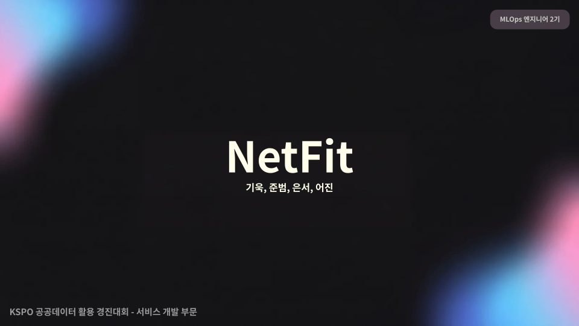

<div align="center">



KSPO 공공데이터 활용 경진대회 - 서비스 개발 부문 
#
# Team NetFit <br><br>
기욱, 은서, 준범, 어진
<br><br>

</div>

## 🎮 NetFit은 뭔가요?

체형분석 데이터를 기반으로 운동 미션과 그룹챌린지를 통해 성장하는 **그룹 피트니스 게임 서비스**입니다.

사용자의 위치 기반으로 추천되는 주변 운동시설 안내를 제공하여, 어디서든 쉽게 운동을 시작할 수 있도록 돕습니다.

### 핵심 기능 5가지

| 기능 | 설명 |
|------|------|
| **캐릭터 생성** | 키·몸무게·골격근량·체지방률 입력 → 3D 캐릭터 자동 생성 |
| **운동 미션** | 운동 종목·시간·강도 기록 → 경험치·능력치 상승 |
| **그룹 챌린지** | 친구·지역·전국 사용자와 배틀 → 보상 획득 |
| **성장 시스템** | 카드 진화·레벨업 → 시각적 성장감 제공 |
| **시설 안내** | 공공체육시설 데이터 연동 → 위치 기반 운동장소 추천 |


## 🎯 운동, 혼자가 아니라면

### 현 상황

운동을 시작하려는 사람들이 많지만, **혼자서 지속하기 힘들다**

- 운동의 결과를 "시각적으로" 확인하기 어려움
- 공공체육시설 정보가 산재되어 있음  
- 함께할 사람이 없으면 포기하기 쉬움

### NetFit의 답

**✅ 친구·지역·전국과 함께**  
운동 미션과 그룹 챌린지로 함께 성장  
→ 혼자가 아니라 경쟁하고 응원받으면서 동기부여

**✅ 캐릭터 성장으로 시각적 보상**  
매일의 운동이 눈에 보이는 성장으로  
→ 체형 데이터 기반 캐릭터 진화

**✅ 공공시설로 운동을 가까이**  
위치 기반 추천으로 접근성 높임  
→ KSPO 데이터 연동해 주변 시설 정보 제공

**혼자라는 생각에서 벗어날 때, 운동은 계속된다**

---

## 📊 활용한 KSPO 데이터

### 데이터 소스

**📍 공공체육시설 정보**
- 시설명, 위치(위도·경도), 운영시간
- 보유 종목, 면적, 시설 상태
- 지역별·종목별 분포 데이터

**📈 스포츠 통계**
- 운동 종목별 인기도
- 지역별 체육시설 현황
- 인구당 시설 비율

### NetFit에서의 활용

**1️⃣ "내 주변 시설" 기능**

사용자 위치(GPS) + KSPO 시설 데이터 → 가장 가까운 운동장소 3-5개 추천 → 운영시간, 시설 정보 실시간 제공

**2️⃣ 지역 확장 배틀**

KSPO 지역별 시설 분포 데이터 → "강남구 최강자", "서초구 랭킹" 등 지역 기반 배틀 → 지역 커뮤니티 형성

**3️⃣ 운동 종목 추천**

지역의 공공시설에 실제 있는 종목만 추천 → 사용자가 실제로 갈 수 있는 시설의 정보만 제공 → 공공시설 활용도 자연스럽게 증대

### 데이터 처리 방식

KSPO 공공 데이터 (CSV 형식) → 데이터 정제 & 가공 → SQLite 데이터베이스 저장 → 사용자 위치 기반 필터링 → 실시간 추천 & 표시

**공공데이터가 사용자에게 닿는 순간까지**

---

## 🔄 서비스 플로우

### 사용자 여정

```
1️⃣ 회원가입 / 카카오 로그인
   ↓
2️⃣ 프로필 & 인바디 정보 입력
   (키, 몸무게, 골격근량, 체지방률)
   ↓
3️⃣ 캐릭터 자동 생성 & 미리보기
   ↓
4️⃣ 메인 대시보드 진입
   ├─ 운동 기록
   ├─ 카드 배틀
   ├─ 랭킹 확인
   ├─ 친구 추가
   └─ 주변 시설 검색
   ↓
5️⃣ 운동 시작 & 기록
   ↓
6️⃣ 경험치 획득 & 캐릭터 성장
   ↓
7️⃣ 친구/지역/전국과 배틀
   ↓
8️⃣ 보상 획득 & 레벨 업
```

### 주요 기능 흐름

**프로필 등록**
- 기본 정보 입력 (이름, 성별, 나이)
- 신체 정보 입력 (키, 몸무게, 골격근량, 체지방률)
- 입력된 데이터로 3D 캐릭터 자동 생성
- 캐릭터 미리보기 & 확인

**운동 기록**
- 종목 선택 (러닝, 헬스, 요가, 스포츠 등)
- 시간·강도 입력
- 자동으로 경험치 계산 & 반영
- 캐릭터 배경·능력치 변화 시각화

**카드 배틀**
- 예시 상대와의 1:1 배틀
- 전국 사용자와의 랭킹 배틀
- 친구 간 배틀
- 지역별 확장 배틀

**시설 검색**
- 현재 위치 기반 공공체육시설 조회
- 운영시간·시설 정보 확인
- 거리 기반 추천
- 종목별 필터링

---

## 🛠️ 기술 구현

### 백엔드

**프레임워크**: Python / Django  
**데이터베이스**: SQLite  
**주요 기능**
- 회원 관리 (회원가입, 로그인, 프로필)
- 운동 기록 저장 및 조회
- 배틀 로직 (경험치 계산, 순위 계산)
- API 엔드포인트 (프로필, 운동, 배틀, 랭킹)

**필수 패키지**
```
Django==4.2
djangorestframework==3.14
django-cors-headers==4.0
psycopg2-binary==2.9
python-dotenv==1.0
```

### 프론트엔드

**언어**: HTML / CSS / JavaScript  
**주요 기능**
- 반응형 UI 설계
- 캐릭터 미리보기 (BMI 기반 시각화)
- 실시간 데이터 업데이트
- 페이지 간 부드러운 전환

**주요 페이지**
- 로그인 / 회원가입
- 프로필 설정 및 캐릭터 생성
- 대시보드 (카드 표시)
- 운동 기록 페이지
- 배틀 결과 페이지
- 랭킹 페이지
- 주변 시설 지도

### 데이터 처리

**NumPy**: 경험치, 능력치, 파워 계산  
**Beautiful Soup / Selenium**: 공공체육시설 데이터 수집  
**CSV 처리**: KSPO 공공데이터 업로드 및 처리

**주요 계산 로직**
```
경험치 = 운동시간 × 강도 계수
능력치 = (근력 + 순발력 + 근지구력 + 심폐지구력 + 유연성 + 평형성) / 6
카드 진화 = 누적 경험치 임계값 도달 시 자동 진화
```

---

## 👥 팀 소개

| 이름 | 역할 | 담당 |
|------|------|------|
| **기욱** | 팀장 | 프로젝트 관리, 기획, 아키텍처 설계 |
| **준범** | 백엔드 개발 | Django API 개발, DB 설계, 로직 구현 |
| **은서** | 프론트엔드 개발 | UI/UX 개발, 페이지 구현, 디자인 |
| **어진** | 문서 & 디자인 | README 작성, 시각 자료, 발표 자료 |

---

## 📖 시작하기

### 필수 요구사항

- Python 3.8+
- Node.js 12+ (프론트엔드)
- PostgreSQL 또는 SQLite

### 설치 방법

**1. 저장소 클론**
```bash
git clone https://github.com/pes9476/netfit.git
cd netfit
```

**2. 백엔드 환경 설정**
```bash
# 가상 환경 생성
python -m venv venv

# 활성화 (Windows)
venv\Scripts\activate

# 활성화 (macOS/Linux)
source venv/bin/activate

# 패키지 설치
pip install -r requirements.txt

# 데이터베이스 마이그레이션
python manage.py migrate

# 서버 실행
python manage.py runserver
```

**3. 프론트엔드 실행**
```bash
# 프론트엔드 폴더로 이동
cd frontend

# 간단한 HTTP 서버 실행
python -m http.server 8000

# 또는
npx http-server
```

**4. 브라우저 접속**
```
http://localhost:8000
```

### 사용 방법

1. 회원가입 또는 카카오 로그인
2. 신체 정보 입력 (자동 캐릭터 생성)
3. 홈 화면에서 운동 기록 또는 배틀 시작
4. 주변 시설 검색으로 운동장소 찾기
5. 친구 추가해서 함께 성장하기

---

## 🎯 기대효과

### 사용자 입장

- 운동을 '재미있는 게임'으로 경험
- 시각적 성장으로 지속적 동기부여
- 공공시설 접근성 향상
- 커뮤니티를 통한 함께하는 즐거움

### 사회적 가치

✅ **국민 체력 향상 장려** - 게임화를 통한 운동 참여도 증대  
✅ **공공체육시설 활용도 증대** - 데이터 기반 시설 추천으로 이용률 상승  
✅ **운동 데이터 기반 맞춤형 서비스** - 개인의 운동 특성에 맞는 추천  
✅ **지역 건강 커뮤니티 형성** - 지역 기반 배틀과 챌린지로 주민 결속력 강화

---

## 🔮 향후 계획

### Phase 2 (3개월)
- 모바일 앱 개발 (React Native)
- 웨어러블 기기 연동 (Apple Watch, Fitbit)
- SNS 공유 기능 확대

### Phase 3 (6개월)
- AI 기반 운동 추천 시스템
- 실시간 영상 피드백
- 운동 커뮤니티 강화

### 상용화 방향
- 프리미엄 기능 (맞춤형 운동 플랜)
- 협력 기업 광고 (스포츠 용품)
- B2B 서비스 (헬스장, 체육관)

---

## 📝 라이선스

MIT License - 자유롭게 사용, 수정, 배포 가능

---

## 📧 문의

**이메일**: netfit.kspo@gmail.com  
**GitHub**: https://github.com/pes9476/netfit

---

**운동, 혼자가 아니라면 계속된다**  
**Team NetFit과 함께 시작해보세요!** 💪🎮


# 핏배틀 카드 성장·배틀 테스트 버전 v10

대시보드와 각 기능 화면을 분리한 Django 테스트 버전입니다. 대시보드는 내 카드 요약만 보여주고, 메뉴를 누르면 각각의 전용 페이지로 이동합니다.

## 새 압축파일을 풀어 처음 실행할 때

VS Code에서 `manage.py`가 보이는 폴더를 열고, 터미널에 아래를 한 줄씩 입력합니다.

```bash
py -m pip install -r requirements.txt
py manage.py migrate
py manage.py runserver
```

브라우저에서 `http://127.0.0.1:8000/`을 엽니다.

## 이미 실행하던 1번 프로젝트에 새 파일을 덮어썼을 때

```bash
py manage.py migrate
py manage.py runserver
```

`migrate`는 처음 한 번만 실행하면 됩니다. 다음 실행부터는 아래 한 줄만 사용하세요.

```bash
py manage.py runserver
```

## 확인할 기능

1. `프로필·인바디`에서 성별·나이·키·몸무게·골격근량·체지방률을 저장합니다.
2. 입력값에 맞춰 미리보기 캐릭터가 바뀌는지 확인한 뒤 저장합니다. 어린이·성인·시니어 / 여성·남성 / 날씬·균형·통통·활동·강한 운동형 조합을 사용합니다.
3. 대시보드의 3D 캐릭터 카드가 바뀌는지 확인합니다.
4. `운동 기록`에서 종목을 고르면 오른쪽 배경 미리보기가 바로 바뀝니다. 저장한 가장 최근 운동 종류는 대시보드 카드 배경에도 적용됩니다.
   캐릭터는 운동 배경 위에 선명하게 표시되며, 캐릭터 주변에 흰 테두리가 생기지 않도록 처리했습니다.
5. 대시보드의 테스트 버튼으로 실버·골드·마스터 카드 프레임과 레벨업 능력치 변화를 확인합니다.
6. `카드 배틀`에서 예시 상대를 눌러 배틀 결과 화면을 확인합니다. 보상은 커피·밥·치킨·카페 디저트·영화·직접 입력을 지원합니다.
7. `랭킹`에서 전국·내 지역·친구 필터와 예시 랭킹을 확인합니다.
8. 다른 계정을 하나 더 회원가입한 뒤, `친구`에서 그 닉네임을 입력해 친구를 추가합니다.
9. `지역 확장`에서 내 지역·인접 지역·전국 배틀을 모두 테스트할 수 있습니다.
10. `내 주변 시설`은 공공체육시설 CSV를 연결할 전용 페이지입니다.

## 사용 기술

- Python / Django / SQLite: 회원, 프로필, 인바디 기록, 운동 기록, 친구, 랭킹, 카드 배틀 데이터
- HTML / CSS / JavaScript: 화면, 메뉴별 페이지 이동, BMI 미리보기, 카드·배틀 애니메이션
- NumPy: 경험치, 카드 능력치, 카드 파워 계산
- Beautiful Soup: 체육시설 홈페이지 수집 예시 명령어
- Selenium: 로그인 화면 자동 확인 예시

## 공공체육시설 CSV 연결

나중에 CSV 파일을 준비한 뒤 아래 형식으로 실행합니다.

```bash
py manage.py import_facilities "CSV 파일 경로"
```

성장 경험치는 운동 기록으로만 쌓입니다. 인바디 값은 캐릭터 외형 참고용이며 의료 진단 기능이 아닙니다.
