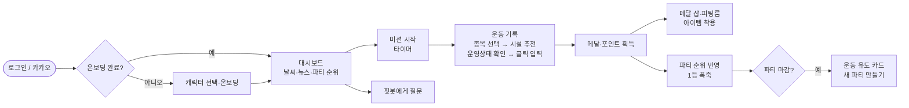
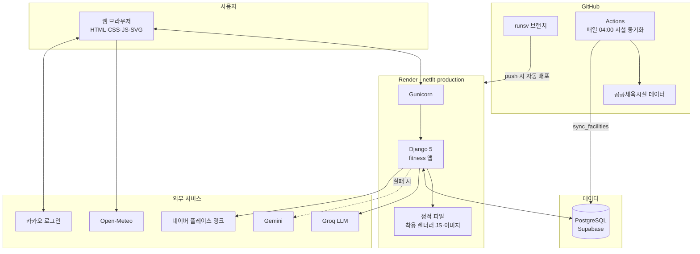
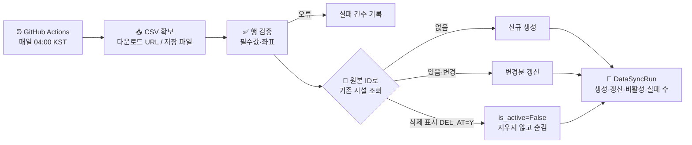
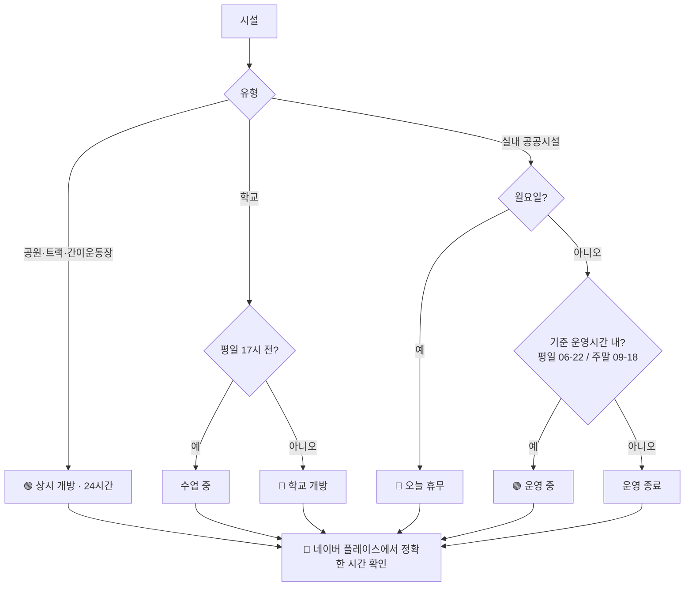
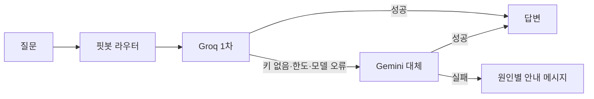
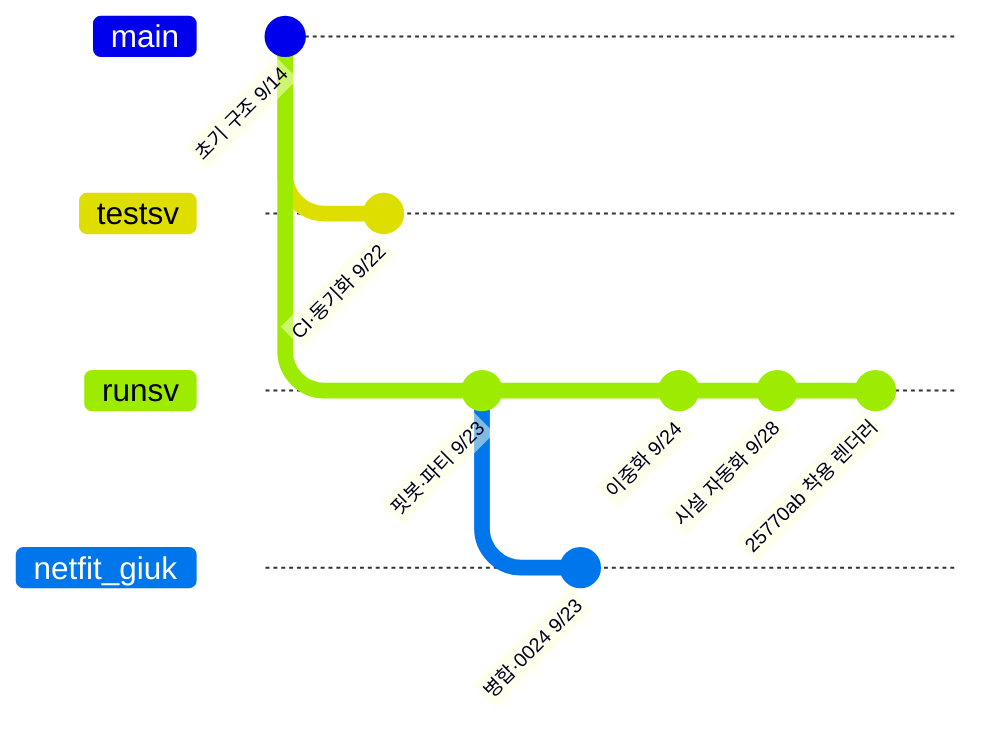

# 🏃 NetFit (넷핏)

**캐릭터와 함께 성장하는 게임형 공공 피트니스 플랫폼**

> 2026 국민체육진흥공단 공공데이터 활용 경진대회 · 서비스 개발 부문 출품작
> 🌐 운영 중: https://netfit-production.onrender.com/

> 📌 **이 README의 이미지 표시 규칙**
> `🖼️ [IMG-xx · PPT Sxx]` 블록은 발표자료(PPT)에서 만든 그림을 README에도 끼워 넣을 자리다. PPT 슬라이드를 이미지로 내보낸 뒤 `docs/images/IMG-xx.png`로 저장하면 된다. 그 전까지는 아래 Mermaid 다이어그램이 대신 표시된다.

---

## 목차
1. [한 줄 소개](#1-한-줄-소개)
2. [왜 만들었나](#2-왜-만들었나)
3. [핵심 기능](#3-핵심-기능)
4. [사용자 워크플로우](#4-사용자-워크플로우)
5. [시스템 아키텍처](#5-시스템-아키텍처)
6. [기술 스택과 선택 이유](#6-기술-스택과-선택-이유)
7. [데이터 수집·자동화 파이프라인](#7-데이터-수집자동화-파이프라인)
8. [Django를 어떻게 활용했나](#8-django를-어떻게-활용했나)
9. [핵심 아이디어 5가지](#9-핵심-아이디어-5가지)
10. [개발·배포 워크플로우](#10-개발배포-워크플로우)
11. [실행 방법](#11-실행-방법)
12. [테스트·수행 결과](#12-테스트수행-결과)
13. [팀](#13-팀)

---

## 1. 한 줄 소개

운동을 기록하면 캐릭터가 꾸며지고, 친구와 내기를 하고, **지금 열려 있는 내 주변 공공체육시설**을 추천받고, AI 코치 '핏봇'에게 물어볼 수 있는 웹 서비스.

> 🖼️ **[IMG-01 · PPT S02] 서비스 한 장 요약**
> 가운데 네 마스코트(백호·토리·아콩·포동), 둘레에 4개 아이콘: 운동 기록 / 파티 내기 / 주변 시설 / 핏봇

---

## 2. 왜 만들었나

| 문제 | NetFit의 접근 |
|---|---|
| 운동은 시작보다 **지속**이 어렵다 | 캐릭터 성장·꾸미기·미션·파티 내기로 반복 동기 |
| 공공체육시설 데이터는 있지만 **쓰기 어렵다** | 종목별 추천 + 운영상태 배지 + 장소 자동 입력 |
| 데이터는 한 번 넣으면 **낡는다** | 매일 자동 갱신 파이프라인 |
| 무료 AI는 **자주 막힌다** | 두 AI를 이어 붙인 이중화 |
| 팀에 개발 전공자가 **없다** | 사람은 문제 정의·검수, AI 도구는 구현 |

---

## 3. 핵심 기능

| 영역 | 기능 |
|---|---|
| 🧸 캐릭터 | 4종 마스코트, 16종 아이템 구매·착용, 부위별 동시 착용(밴드+선글라스+헤드셋) |
| 📋 미션 | 개인 일일 미션, 운동 타이머, 배지 컬렉션 |
| 👥 파티 | 종목·목표·마감·내기 설정, 방장 설정 미션, 순위 칩(🥇🥈🥉), 1등 폭죽, 마감 후 자동 전환 |
| 📍 시설 | 종목별 주변 공공시설 추천(새로고침 없음), 클릭 시 장소 자동 입력, 운영상태 배지, 네이버 플레이스 연결 |
| 🤖 핏봇 | 전역 AI 코치 위젯, 시설 정보 결합, Groq→Gemini 대체 호출 |
| 🌦️ 대시보드 | GPS 실측 날씨 + 실내외 팁, 스포츠 뉴스 롤링, 튼튼머니 안내 팝업 |

---

## 4. 사용자 워크플로우

> 🖼️ **[IMG-02 · PPT S04] 사용자 여정 맵** ← **필수 이미지**
> 가로 6단계 여정. 각 단계 위에 사용자 감정(😐→😊→🔥→🎉), 아래에 해당 기능.


```mermaid
flowchart LR
    A([로그인 / 카카오]) --> B{온보딩 완료?}
    B -- 아니오 --> C[캐릭터 선택·온보딩]
    B -- 예 --> D[대시보드<br/>날씨·뉴스·파티 순위]
    C --> D
    D --> E[미션 시작<br/>타이머]
    D --> H[핏봇에게 질문]
    E --> F[운동 기록<br/>종목 선택 → 시설 추천<br/>운영상태 확인 → 클릭 입력]
    F --> G[메달·포인트 획득]
    G --> I[메달 샵·피팅룸<br/>아이템 착용]
    G --> J[파티 순위 반영<br/>1등 폭죽]
    J --> K{파티 마감?}
    K -- 예 --> L[운동 유도 카드<br/>새 파티 만들기]
```

---

## 5. 시스템 아키텍처

> 🖼️ **[IMG-03 · PPT S05] 시스템 아키텍처** ← **필수 이미지**
> 왼쪽 사용자, 가운데 Render 위 Django, 오른쪽 DB, 위쪽 외부 API 4개, 아래쪽 GitHub(Actions). 무료 서비스에는 "0원" 스티커.


```mermaid
flowchart TB
    subgraph Client[사용자]
        BR[웹 브라우저<br/>HTML·CSS·JS·SVG]
    end
    subgraph Render[Render · netfit-production]
        GU[Gunicorn] --> DJ[Django 5<br/>fitness 앱]
        DJ --> ST[정적 파일<br/>착용 렌더러 JS·이미지]
    end
    subgraph Data[데이터]
        PG[(PostgreSQL<br/>Supabase)]
    end
    subgraph External[외부 서비스]
        GR[Groq LLM]
        GE[Gemini]
        OM[Open-Meteo]
        NV[네이버 플레이스 링크]
        KK[카카오 로그인]
    end
    subgraph GitHub[GitHub]
        RV[runsv 브랜치]
        GA[Actions<br/>매일 04:00 시설 동기화]
        PD[공공체육시설 데이터]
    end
    BR <--> GU
    DJ <--> PG
    DJ --> GR
    DJ -.실패 시.-> GE
    BR --> OM
    DJ --> NV
    BR <--> KK
    RV -->|push 시 자동 배포| Render
    GA --> PD
    GA -->|sync_facilities| PG
```

---

## 6. 기술 스택과 선택 이유

> 🖼️ **[IMG-04 · PPT S06] 기술 스택 카드** — 카드 6장, 각 카드에 로고 + "왜?" 한 줄

| 분류 | 기술 | 왜 이걸 골랐나 |
|---|---|---|
| **백엔드** | Python 3.13 · Django 5.x | 로그인·DB·관리자·마이그레이션·화면이 기본 포함. 비전공자 팀이 부품을 조립하지 않고 **바로 서비스**를 만들 수 있다. 데이터 처리도 같은 Python |
| **화면** | Django 템플릿 · Vanilla JS · CSS | 빌드 도구·프레임워크 학습 없이 바로 수정. 필요한 곳만 `fetch`로 비동기 |
| **캐릭터** | SVG + PNG 레이어 | 3D 엔진 없이도 부위별 착용·애니메이션 가능 |
| **DB** | PostgreSQL(Supabase) / SQLite | 운영은 무료 관리형 DB, 로컬은 설치 없는 파일 DB. Django ORM이 둘을 같은 코드로 다룸 |
| **자동화** | GitHub Actions | 서버를 24시간 켜두지 않고도 매일 정해진 시간에 명령 실행. 무료 |
| **AI** | Groq(1차) + Gemini(대체) | 둘 다 무료 티어. 한쪽의 한도·장애를 다른 쪽이 흡수 |
| **날씨** | Open-Meteo (+METAR) | API 키 없이 위경도로 실측값. 기상청 격자 변환 불필요 |
| **지도 정보** | 네이버 플레이스 검색 링크 | 유료 지도 API 없이 최신 상세정보·리뷰로 연결 |
| **배포** | Render · Gunicorn | `runsv`에 push하면 자동 빌드·배포, `/healthz/`로 상태 확인 |
| **품질** | Django 테스트 · Node 테스트 러너 · CI | 운영(`runsv`)과 테스트(`testsv`) 분리, 회귀 방지 |

> 💡 초기에는 Railway 배포도 검토했지만, 최종 운영은 **Render**로 통일하고 Railway 설정은 9/23 제거했다.

---

## 7. 데이터 수집·자동화 파이프라인

### 사용 공공데이터
- 전국 공공체육시설 데이터 (CSV) — 제공처·URL: **[확인 필요 — 공모 요건상 국민체육진흥공단/체육종합빅데이터센터 데이터 1건 이상 명시]**
- 국민체육진흥공단 '튼튼머니' 안내 정보

> 🖼️ **[IMG-05 · PPT S07] 공공데이터 자동 갱신 파이프라인** ← **필수 이미지 · 발표 핵심**
> 왼쪽→오른쪽 컨베이어 벨트 모양. ⏰ 04:00 → 📥 다운로드 → ✅ 검증 → 🔑 원본 ID 대조 → [신규 / 갱신 / 숨김] 세 갈래 → 📒 실행 기록. "숨김" 옆에 "지우지 않는다 = 운동 기록 보존" 말풍선.


```mermaid
flowchart LR
    T[⏰ GitHub Actions<br/>매일 04:00 KST] --> DL[📥 CSV 확보<br/>다운로드 URL / 저장 파일]
    DL --> V[✅ 행 검증<br/>필수값·좌표]
    V -->|오류| E[실패 건수 기록]
    V --> K{🔑 원본 ID로<br/>기존 시설 조회}
    K -->|없음| N[신규 생성]
    K -->|있음·변경| U[변경분 갱신]
    K -->|삭제 표시 DEL_AT=Y| S[is_active=False<br/>지우지 않고 숨김]
    N & U & S --> R[📒 DataSyncRun<br/>생성·갱신·비활성·실패 수]
```

**설계 포인트**
1. **수집과 반영을 분리** — 원본 확보 방식(수동 업로드 / URL 다운로드)이 바뀌어도 검증·반영 코드는 그대로.
2. **원본 ID 기준 upsert** — 몇 번을 다시 돌려도 중복 없음 (로컬 검증: 44,612행, 실패 0).
3. **Soft Delete** — 폐업 시설을 지우면 그 시설을 참조하던 운동 기록이 깨진다.
4. **실행 기록** — "언제, 몇 건이 바뀌었나"를 DB에 남겨 운영자가 추적.

> ⚠️ 운영 환경의 예약 실행 성공 여부와, 원본 사이트의 로그인 없는 다운로드 가능 여부는 제출 전 Actions 로그로 확인한다.

### 시설 운영상태 판별

> 🖼️ **[IMG-06 · PPT S08] 운영상태 판별 트리**
> 시설 유형 3갈래(야외 / 학교 / 실내) → 요일·시각 → 배지 4색(민트 상시 개방, 파랑 학교 개방, 초록 운영 중, 빨강 오늘 휴무)


```mermaid
flowchart TD
    F[시설] --> T{유형}
    T -->|공원·트랙·간이운동장| A[🟢 상시 개방 · 24시간]
    T -->|학교| B{평일 17시 전?}
    B -->|예| B1[수업 중]
    B -->|아니오| B2[🔵 학교 개방]
    T -->|실내 공공시설| C{월요일?}
    C -->|예| C1[🔴 오늘 휴무]
    C -->|아니오| D{기준 운영시간 내?<br/>평일 06-22 / 주말 09-18}
    D -->|예| D1[🟢 운영 중]
    D -->|아니오| D2[운영 종료]
    A & B1 & B2 & C1 & D1 & D2 --> L[🔗 네이버 플레이스에서 정확한 시간 확인]
```
> 원본 데이터에 표준 운영시간이 없어 **유형별 기준 시간**을 쓰고, 정확한 정보는 네이버 링크로 보완한다.

---

## 8. Django를 어떻게 활용했나

| Django 기능 | NetFit에서의 쓰임 |
|---|---|
| 인증(`auth_user`, `AuthenticationForm`) | 일반 로그인, 카카오 로그인 계정 연결 |
| ORM + 마이그레이션 | 시설·파티·아이템 모델, 원본 ID 정렬 마이그레이션, 브랜치 병합 시 마이그레이션 분기 연결(`0024_merge`) |
| 관리 명령(`manage.py sync_facilities`) | 데이터 파이프라인을 **웹과 분리된 명령**으로 → Actions에서 그대로 실행 |
| 템플릿 | 대시보드·피팅룸 등 서버 렌더링, 조건에 따라 카드 전환(파티 마감) |
| JSON 뷰 | 시설 추천·핏봇 비동기 응답 |
| 정적 파일(`collectstatic`) | 착용 렌더러 JS·캐릭터 이미지 배포 |
| 테스트 | 파티 필터·배포 설정·핏봇·날씨 회귀 테스트 |
| 설정 분리(환경변수) | DB·API 키를 코드 밖으로, 로컬 SQLite / 운영 PostgreSQL 전환 |

---

## 9. 핵심 아이디어 5가지

> "대단한 기술"이 아니라 **흔한 기술을 제자리에 쓴 것**이 NetFit의 강점이다.

### ① 서버 없는 스케줄러 — GitHub Actions로 매일 데이터 갱신
상시 서버·유료 스케줄러 없이 무료 CI의 예약 실행으로 파이프라인을 돌린다. → IMG-05

### ② 무료 AI 두 개 이어 붙이기 — 핏봇 이중화
> 🖼️ **[IMG-07 · PPT S09] 핏봇 이중화 구조** — 신호등처럼 1차 Groq 초록, 실패 시 노란 화살표로 Gemini, 둘 다 실패 시 빨간 "원인 안내"


```mermaid
flowchart LR
    Q[질문] --> R[핏봇 라우터] --> G1[Groq 1차]
    G1 -->|성공| A[답변]
    G1 -->|키 없음·한도·모델 오류| G2[Gemini 대체]
    G2 -->|성공| A
    G2 -->|실패| M[원인별 안내 메시지]
```

### ③ 3D 엔진 대신 "이미 맞춰진 그림에서 필요한 부분만"
> 🖼️ **[IMG-08 · PPT S12] 착용 렌더러 Before / After** ← **필수 이미지 · 실제 캡처 사용**
> 왼쪽: 수정 전 토리 얼굴에 장비가 뭉친 캡처 / 오른쪽: 네 캐릭터가 밴드·선글라스·헤드셋을 동시 착용한 캡처. 가운데 화살표에 "따로 붙이기 → 같은 좌표에서 잘라 보기"

- 수정 전: 장비마다 크기·위치·움직임을 따로 보정 → 떠 보이고 얼굴에 겹침
- 수정 후: 캐릭터에 맞춰진 착용 원본 좌표 유지 → 부위별 표시 영역 → 고정 레이어 순서 → 캐릭터와 한 몸으로 움직임
- 피팅룸·미리보기·테스트가 **같은 렌더러 코드**를 사용

### ④ 배치 서버 없는 마감 처리 — "보는 순간 비교"
> 🖼️ **[IMG-09 · PPT S11] 파티 마감 전환** — 대시보드 카드 두 장 비교: 진행 중(순위 칩) / 종료(운동 유도 카드)

화면을 여는 순간 `deadline_dt < now`를 비교해 끝난 파티는 목록에서 빼고 운동 유도 카드로 바꾼다. 데이터는 지우지 않는다.

### ⑤ 한 줄로 막은 버그 — `translate="no"`
> 🖼️ **[IMG-10 · PPT S10] 번역기 오작동 전후** — '아콩→아', '흐림→림' 캡처 vs 정상 화면

브라우저 자동 번역이 마스코트 이름과 날씨를 잘라먹던 문제를 웹 표준 속성으로 차단.

---

## 10. 개발·배포 워크플로우

> 🖼️ **[IMG-11 · PPT S13] 브랜치·배포 흐름** — 지하철 노선도 스타일. 개인 브랜치 → testsv(검사역) → runsv(운영역) → Render 종착역


```mermaid
gitGraph
    commit id: "초기 구조 9/14"
    branch testsv
    commit id: "CI·동기화 9/22"
    checkout main
    branch runsv
    commit id: "핏봇·파티 9/23"
    branch netfit_giuk
    commit id: "병합·0024 9/23"
    checkout runsv
    commit id: "이중화 9/24"
    commit id: "시설 자동화 9/28"
    commit id: "25770ab 착용 렌더러"
```

**팀 협업 규칙 (실제 사고에서 나온 것)**
- 운영 반영은 `runsv`만. 테스트는 `testsv`에서.
- 푸시가 거절되면 **강제 푸시 금지** → 최신을 받아 그 위에 다시 올린다.
- 같은 이름 파일 충돌 시 날짜 붙여 백업 후 병합.
- 비밀키는 `.env`에만, `.gitignore` 등록 (Secret Scanning 거부 경험).
- AI에게 구현을 맡기되, **합격 기준(캡처·위치)은 사람이 정한다**.

> 🖼️ **[IMG-12 · PPT S03/S13] 개발 타임라인** — 9/14 → 10/2 가로 타임라인, 주요 사건 아이콘

---

## 11. 실행 방법

```bash
git clone https://github.com/pes9476/netfit.git
cd netfit
python -m venv .venv && source .venv/bin/activate   # Windows: .venv\Scripts\activate
pip install -r requirements.txt
cp .env.example .env        # API 키·DB 설정 입력 (USE_SQLITE=True 로 로컬 실행)
python manage.py migrate
python manage.py sync_facilities   # 시설 데이터 동기화 (옵션은 --help 참고)
python manage.py runserver
```

착용 렌더러 테스트:
```bash
node --test fitness/test_outfit_renderer.cjs
```

> 환경변수 이름(`GEMINI_API_KEY`/`GOOGLE_API_KEY`, Groq 키, DB URL 등)은 `.env.example`을 기준으로 한다.

---

## 12. 테스트·수행 결과

> 🖼️ **[IMG-13 · PPT S14] 결과 대시보드** — 숫자 카드 4개 + 시연 캡처 3장

| 항목 | 결과 |
|---|---|
| Render 운영 배포 (`25770ab`) | ✅ Deploy succeeded · Live |
| `/healthz/` | ✅ 200 `status: ok` |
| 착용 렌더러 테스트 | ✅ 3 / 3 |
| 시설 동기화 (로컬) | ✅ 44,612행 · 실패 0 · 재실행 중복 0 |
| 통합 테스트 (9/28) | 🟡 26 / 27 — 날씨 위치명 기대값 갱신 필요 |

---

## 13. 팀

| 이름 | 담당 | GitHub |
|---|---|---|
| 박준범 | 실시간 대시보드, 파티, 핏봇 이중화, 시설 자동화·운영상태 | [@juntigger](https://github.com/juntigger) |
| 박은서 | 착용 렌더러, 핏봇 Gemini, 파티 표시, 운영 배포 | [@pes9476](https://github.com/pes9476) |
| 기욱 | Supabase·DB 연결 및 모델 구성, 관리자 환경 점검, 백엔드 테스트·디버깅과 안정성 개선, CI/CD·ETL 파이프라인 설계, 브랜치·마이그레이션 통합 및 기술 문서화 | [@GitJANG961013](https://github.com/GitJANG961013) |
| 어진 | [확인 필요] | [확인 필요] |

---

<sub>© 2026 NetFit Team · 공공데이터 활용: 전국 공공체육시설 데이터 [출처 표기 필요]</sub>
